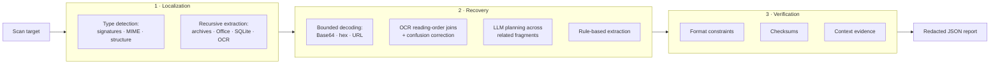

<div align="center">

# DIVIDE

**Secret discovery beyond text-only scanning.**

[](https://www.python.org/downloads/)
[](LICENSE)
[](#supported-carriers)
[](#how-it-works)

*API keys do not always leak as plain text. They hide inside archives,
Office documents, SQLite rows, images, and fragmented encodings —
blind spots that text-based scanners never reach.*

</div>

---

## Why DIVIDE

Text-based secret scanners miss credentials that are **recoverable but unextracted** —
split across strings, buried in non-text carriers, or masked by encoding.
DIVIDE closes this gap with a three-stage pipeline that **localizes** any carrier,
**recovers** complete candidate secrets, and **verifies** them offline.

| | DIVIDE | Gitleaks / TruffleHog |
|---|---|---|
| Carriers | Text, archives, Office, PDF, images, binaries, databases | Text-like files only |
| Fragmented secrets | Reconstructed (decoding, OCR joins, LLM planning) | Missed |
| Verification | Format constraints + checksums, zero network calls | Regex / network-dependent |

**Headline results** (3,340-file benchmark, 4,705 annotated secret occurrences):

- **91.07% precision / 81.77% recall** (F1 0.86) under unique-secret normalization, outperforming all evaluated scanners
- Beats the Qwen3-VL-30B foundation-model baseline by **+1.95pp precision / +5.63pp recall**
- **61–78% faster** than foundation-model baselines on non-image and image subsets

## How it works



Each stage lives in its own package — the code layout mirrors the paper:

| Paper module | Code | What it does |
|---|---|---|
| §2.1 Localization | [`src/divide/localization/`](src/divide/localization/) | Detects actual content types and recursively extracts carrier records |
| §2.2 Recovery | [`src/divide/recovery/`](src/divide/recovery/) | Reconstructs candidates: decoding, OCR joins, LLM-planned fragment assembly |
| §2.3 Verification | [`src/divide/verification/`](src/divide/verification/) | Offline format, checksum, and context verification with hash-pinned rules |

## Supported carriers

| Handler | Representative inputs |
|---|---|
| Text | Source code, TXT, JSON, CSV, XML, YAML, SVG, PEM |
| Archive | ZIP, TAR, GZIP, 7z, RAR, JAR, APK, RPM, ISO |
| Office | DOC/DOCX, XLS/XLSX, PPT/PPTX, ODF, EPUB, RTF, Outlook |
| Binary | ELF, PE, Mach-O, WASM, audio, video |
| Image | PNG, JPEG, GIF, TIFF, WebP, ICO, PSD |
| PDF | PDF |
| Database | SQLite files, MySQL SQL dumps |
| Gettext | GNU `.mo` catalogs |
| Fallback | Any unrecognized binary (string extraction) |

Missing optional backends degrade to safe fallbacks — run `divide capabilities` to see what is available on your machine.

## Installation

Requires Python 3.12+.

```bash
# from a clone of this repository
pip install .

# or with uv
uv pip install -e . --constraints constraints.txt
```

Optional carrier backends (OCR, 7z, RAR, EPUB, ...) are auto-detected; see
`pyproject.toml` for the full dependency ranges and `constraints.txt` for
pinned reproducible versions.

## Quickstart

```bash
# scan a file or directory (redacted JSON report by default)
divide scan /path/to/project -o report.json

# exit non-zero when secrets are found (CI gate)
divide scan /path/to/project --fail-on-findings

# show what carrier adapters are available here
divide capabilities
```

### CLI reference

```text
divide scan TARGET [OPTIONS]
  -o, --output PATH             JSON report path (default: divide-report.json)
  --config PATH                 YAML configuration override
  --max-depth INT               Recursion depth budget
  --max-object-size INT         Per-object byte budget
  --max-expanded-size INT       Total expansion byte budget
  --max-compression-ratio FLOAT Compression-ratio ceiling
  --ocr / --no-ocr              Toggle image OCR recovery
  --llm-base-url TEXT           OpenAI-compatible local /v1 endpoint
  --llm-model TEXT              Planner model name
  --allow-remote-llm            Explicitly permit non-local endpoints
  --timeout FLOAT               Overall scan deadline (seconds)
  --show-secrets                Include unredacted values (local debug only)
  --fail-on-findings            Exit 1 when any finding is reported

divide capabilities [--json] [--config PATH]
divide benchmark MANIFEST [-o PATH] [--config PATH]
divide ablate MANIFEST [-o PATH] [--config PATH]
divide rules audit [-o PATH] [--config PATH]
```

The same commands work through Python: `python -m divide scan ...`.

### Optional LLM recovery

Fragment-level planning is **off by default** and runs fully offline when enabled
with a locally deployed, OpenAI-compatible endpoint (e.g., vLLM serving
Qwen3-32B-AWQ):

```bash
divide scan target/ --llm-base-url http://localhost:8000/v1 --llm-model qwen3-32b-awq
```

Model output is treated as an untrusted plan: references and operations are
validated against a JSON schema, then replayed by a deterministic executor.
No secret material ever leaves the machine.

## Reproducing the paper

```bash
# RQ1: raw-occurrence and project-unique metrics
divide benchmark dataset-manifest.json -o divide-benchmark.json

# RQ2: full / no-media / no-recovery / no-post-filter ablations
divide ablate dataset-manifest.json -o divide-ablation.json

# rule provenance: origins, versions, hashes, licenses
divide rules audit -o rule-audit.json
```

Every report embeds provenance: git revision, configuration summary, rule
content hashes, and adapter capabilities, so any run can be attributed after
the fact. `divide rules audit` reports the origin, pinned commit, and content
hash of every rule source.

## Configuration

Defaults ship in [`src/divide/default_rules.yaml`](src/divide/default_rules.yaml) —
resource budgets, OCR and LLM settings, verification weights, context lexicons,
and the core credential rules. Every knob is documented inline; override any
subset via `--config your.yaml`.

## Project layout

```text
DIVIDE/
├── src/divide/
│   ├── localization/          # paper §2.1 — type detection + recursive extraction
│   ├── recovery/              # paper §2.2 — decoding, OCR joins, LLM planning, extraction
│   ├── verification/          # paper §2.3 — rules, checksums, hierarchical verifier
│   ├── evaluation/            # RQ1 metrics + RQ2 ablation runner
│   ├── profiles/              # model and prompt profiles (hash-pinned)
│   └── schemas/               # report JSON schema
├── data/                      # multi-type sample carriers (synthetic secrets only)
├── examples/                  # synthetic, non-functional examples only
└── tools/                     # gitleaks snapshot vendoring
```

## Citation

```bibtex
@software{divide2026,
  title  = {DIVIDE: Secret Discovery Beyond Text-Only Scanning},
  author = {Liu, Di and Fan, Zhenye and Tong, Weiyuan and Xu, Shenglin and Wang, Yongjun and Jiang, Zhiyuan},
  url    = {https://github.com/Aiid22/DIVIDE},
  year   = {2026}
}
```

## License

Apache-2.0 — see [LICENSE](LICENSE). The bundled Gitleaks rule snapshot is
vendored under its own MIT license with a pinned content hash; the license
copy ships with the snapshot at
[`src/divide/verification/data/LICENSE.gitleaks`](src/divide/verification/data/LICENSE.gitleaks).
