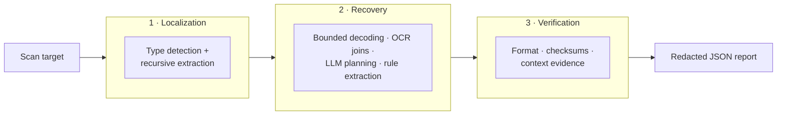

<div align="center">

# DIVIDE

**Secret discovery beyond text-only scanning.**

[](https://www.python.org/downloads/)
[](LICENSE)
[](#supported-carriers)
[](#how-it-works)

*API keys do not always leak as plain text. They hide inside archives,
Office documents, SQLite rows, images, and fragmented encodings —
blind spots that text-based scanners never reach.*

</div>

---

## Why DIVIDE

Text scanners miss credentials that are **recoverable but unextracted** — split across
strings, buried in non-text carriers, or masked by encoding. DIVIDE closes this gap:
**localize** any carrier, **recover** complete candidates, **verify** them offline.

| | DIVIDE | Text-based scanners |
|---|---|---|
| Carriers | Text, archives, Office, PDF, images, binaries, databases | Text-like files only |
| Fragmented secrets | Reconstructed (decoding, OCR joins, LLM planning) | Missed |
| Verification | Format constraints + checksums, zero network calls | Regex only |

On a 3,340-file benchmark (4,705 annotated secret occurrences): **91.07% precision,
81.77% recall (F1 0.86)** — beating all evaluated scanners and the Qwen3-VL-30B
foundation-model baseline, while running **61–78% faster** than the latter.

## How it works



The code layout mirrors the paper: §2.1 [`localization/`](src/divide/localization/) ·
§2.2 [`recovery/`](src/divide/recovery/) · §2.3 [`verification/`](src/divide/verification/).

## Supported carriers

| Family | Formats |
|---|---|
| Text & code | Source code, JSON, YAML, XML, CSV, SVG, PEM |
| Archives | ZIP, TAR, GZIP, 7z, RAR, JAR, APK, RPM, ISO |
| Documents | DOC/DOCX, XLS/XLSX, PPT/PPTX, ODF, EPUB, RTF, PDF |
| Media | PNG, JPEG, GIF, WebP, TIFF, PSD, audio, video |
| Binaries | ELF, PE, Mach-O, WASM |
| Data stores | SQLite, SQL dumps, GNU `.mo` |

Missing optional backends degrade to safe fallbacks — `divide capabilities` shows
what is available on your machine.

## Installation

Requires Python 3.12+.

```bash
pip install .                     # from a clone of this repository
uv pip install -e . --constraints constraints.txt   # development install
```

## Usage

```bash
divide scan /path/to/project -o report.json    # scan (redacted report by default)
divide scan /path/to/project --fail-on-findings  # CI gate: exit 1 on findings
divide capabilities                            # available carrier adapters
```

Key `scan` options: `--config` (YAML override) · `--ocr/--no-ocr` · `--max-depth` ·
`--timeout` · `--show-secrets` (local debug only) · `--fail-on-findings`.
`python -m divide` works the same. Defaults live in
[`default_rules.yaml`](src/divide/default_rules.yaml).

LLM fragment planning is **off by default** and stays local when enabled:

```bash
divide scan target/ --llm-base-url http://localhost:8000/v1 --llm-model qwen3-32b-awq
```

Model output is schema-validated and replayed by a deterministic executor; no secret
material leaves the machine. Remote endpoints require `--allow-remote-llm`.

## Reproducing the paper

```bash
divide benchmark dataset-manifest.json -o divide-benchmark.json   # RQ1
divide ablate dataset-manifest.json -o divide-ablation.json      # RQ2
divide rules audit -o rule-audit.json                            # rule provenance
```

Every report embeds provenance: git revision, config summary, rule content hashes,
and adapter capabilities. Sample carriers with ground-truth labels are in [`data/`](data/);
the full benchmark is released upon paper acceptance.

## Project layout

```text
src/divide/    localization → recovery → verification, plus evaluation and CLI
data/          multi-type samples + labels.jsonl (synthetic secrets only)
examples/      synthetic, non-functional examples
```

## License

Apache-2.0 — see [LICENSE](LICENSE). The bundled Gitleaks rule snapshot ships with
its MIT license at `src/divide/verification/data/LICENSE.gitleaks`.
